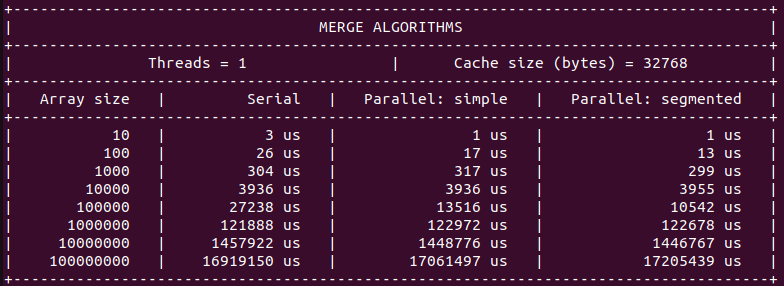
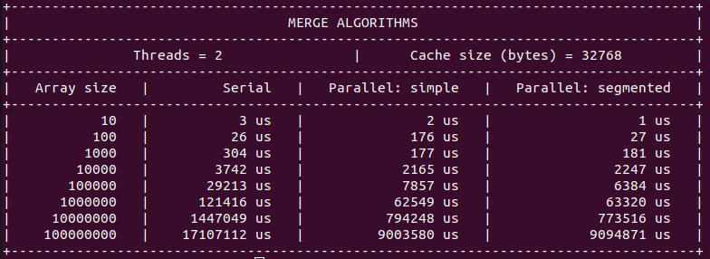
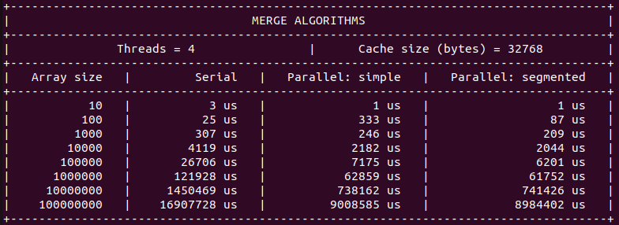
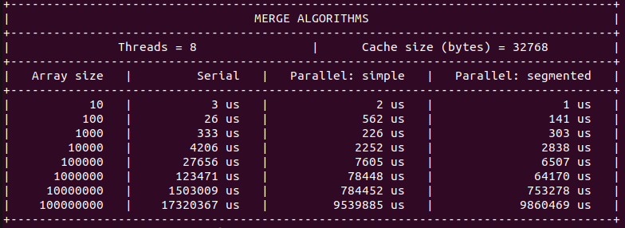
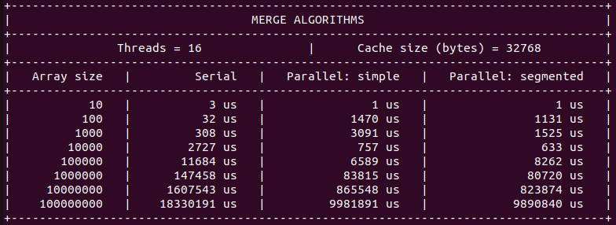
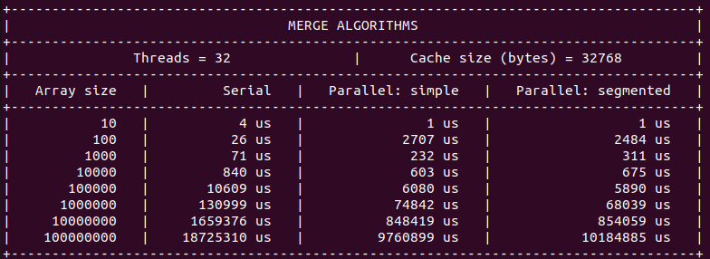
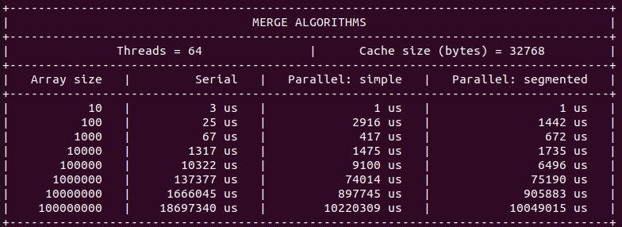

# APS-ParallelMerge

This project is part of the class "Advanced Parallel Systems". It is
a fundamental subject for the [Master of Science in Informatics at
Grenoble](https://mosig.imag.fr/) of the university [Grenoble INP-Ensimag](https://ensimag.grenoble-inp.fr/).

## Introduction

The goal of this project is to study and implement the algorithm proposed in
the paper: [Merge Path - A Visually Intuitive Approach to Parallel Merging](https://arxiv.org/pdf/1406.2628.pdf).
It is an efficient way of merging two sorted arrays, either cache aware or not.

### Prerequisites

You must have GCC, make and OpenMP installed on your local machine.

```
sudo apt update
```

```
sudo apt install build-essential
```

```
sudo apt install libomp-dev
```

### Running the project

Clone the repository.

```
git clone https://github.com/gAkira/APS-ParallelMerge.git
cd APS-ParallelMerge
```

### Setting parameters

You can change the value of some parameters (such as cache size and number of
threads) editing the main file.

```
nano src/main.c
```

### Usage

To see a list of available options about how to run this code.

```
make help
```

To run the code.

```
make run
```

## Some results

Below we can see some of the results obtained, when sorting the same random
array using different merging strategies and changing the number of threads
used.

### Threads = 1 and Cache size = 32768 B



### Threads = 2 and Cache size = 32768 B



### Threads = 4 and Cache size = 32768 B



### Threads = 8 and Cache size = 32768 B



### Threads = 16 and Cache size = 32768 B



### Threads = 32 and Cache size = 32768 B



### Threads = 64 and Cache size = 32768 B



### Conclusion

From these images we can see that for small arrays (smaller than 1000 elements)
the serial merge sort is usually faster, but for larger arrays (such as 1e8
elements) the parallelization using the merge path looks efficient, since we
can even reduce the running time by two!
Another point to notice is that we cannot see much difference between the
segmented strategy and the unsegmented one.
